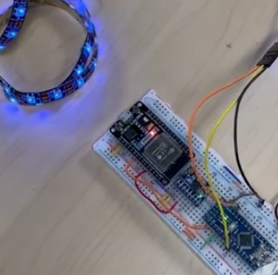
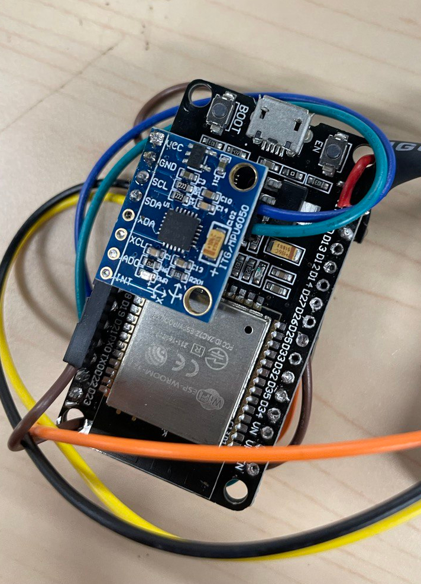
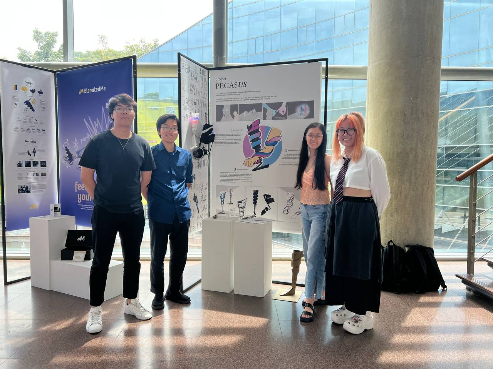

# NTU DR2014 Body Centric Design: Project Pegas-US

This is the repository for Nanyang Technological University's AY23/24 Semester 1 DR2014 Body Centric Design course project Pegas-US.

# Project Description

**Project Pegas-US**: fostering connection, involving their loved ones in the prosthetic users emotional journey.

The project includes 2 pieces
|Leg | Arm|
|---|---|
|The leg piece is a reimagined design of the prosthetics, allowing self-expression beyond the normal functional prosthetics| The arm piece is a wearable for the loved ones, allowing them to experience the attention that the amputee experiences. However, the attention is not of malice but of curiosity and awe|
|The movement will control the **red** light |The movement will control the **blue** light |

- The lighting and the speed is reflected in both pieces
- When the 2 lights overlap, magenta light will be shown

# Electronics

- Each piece has an LED strip that is controlled by an Arduino Nano and the communication between the two is done via Bluetooth with ESP32. The measurement of the movement is done via MPU6050, measuring the acceleration and angular acceleration.

|  |  |
| ----------------------------------------------- | -------------------------------------------- |
| Breadboard Prototype                            | Compact                                      |

# Team

From left to right: Vincent Koh, Than Duc Huy, Tasha Khor, Qin Ai Xin
